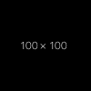

Acompanhe artigos sobre diversos assuntos envolvendo tecnologia, programação e também outras áreas.

Até o momento em que digito este artigo, a estrutura do site consiste na página inicial que lista todos os artigos escritos e a página de leitura, onde você lê este artigo, gerada a partir dos arquivos Markdown existentes.

<div align="center">
  
</div>

Por fim, uma dica de como colocar imagens no Markdown compatível com o Github. Adicione uma tag `` e adicione o caminho relativo da imagem no seu repositório. Na imagem acima foi utilizado:

``

E mais uma dica, para alinhar imagens ao centro, use: 

```
<div align="center">
    
</div>
```